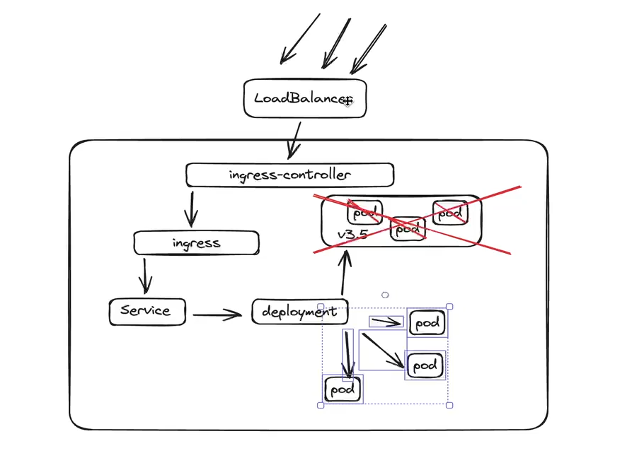
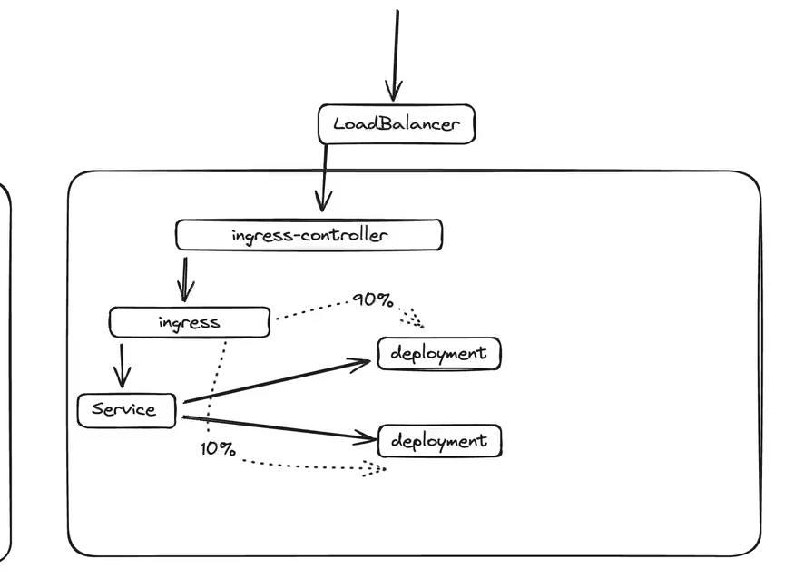
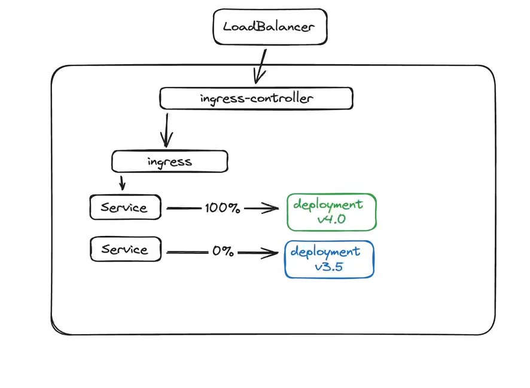

### Rolling Update

    

O Kubernetes vai substituindo pod a pod do replicaset progressivamente conforme os novos pods vao ficando saudaveis.

### Canary

    

### Blue-Green

### Helm install rollouts (argo)
helm repo add argo https://argoproj.github.io/argo-helm
helm install rollouts argo/argo-rollouts -f rollouts_values.yaml -n argocd

### O Argo Rollouts substitui o Deployment, por ele que gerencia os ReplicaSets
apiVersion: argoproj.io/v1alpha1
kind: Rollout
metadata:
  name: {{ .Release.Name }}
spec:
  replicas: {{ .Values.helloWorld.replicas }}
  selector:
    matchLabels:
      app: {{ .Release.Name }}
  strategy:
    canary:
      analysis:
        templates:
        - templateName: {{ .Release.Name }}
        startingStep: 2
      canaryService: {{ .Release.Name }}-canary
      stableService: {{ .Release.Name }}
      trafficRouting:
        nginx:
          stableIngress: {{ .Release.Name }}
      steps:
      - setWeight: 20
      - pause: {duration: 30s}
      - setWeight: 40
      - pause: {duration: 1m}
      - setWeight: 60
      - pause: {duration: 1m}
      - setWeight: 80
      - pause: {duration: 2m}
  template:
    metadata:
      labels:
        app: {{ .Release.Name }}
    spec:
      containers:
        - image: {{ .Values.helloWorld.image }}
          name: {{ .Release.Name }}
          ports:
            - containerPort: {{ .Values.helloWorld.port }}
          imagePullPolicy: {{ .Values.helloWorld.imagePullPolicy }}

### Eu informo qual é o ingress "Stable", e o argo vai criar um Ingress pro Canary

### Install helm chart demo:
helm install -f ./app/values.yaml hellowrold ./app/

###
nginx_ingress_controller_requests{ingress=~"hellowrold"}

### Analysis Runs
k describe analysisruns hellowrold-d7d768f54-2

### Eu posso ter uma análise diferente para cada etapa do Rollout Canary

### Blue Green Pre e Pos Analyis:
spec:
  strategy:
    blueGreen:
      autoPromotionEnabled: boolean
      autoPromotionSeconds: *int32
      antiAffinity: object
      previewService: string
      prePromotionAnalysis: object
      postPromotionAnalysis: object
      previewReplicaCount: *int32
      scaleDownDelaySeconds: *int32
      scaleDownDelayRevisionLimit: *int32
